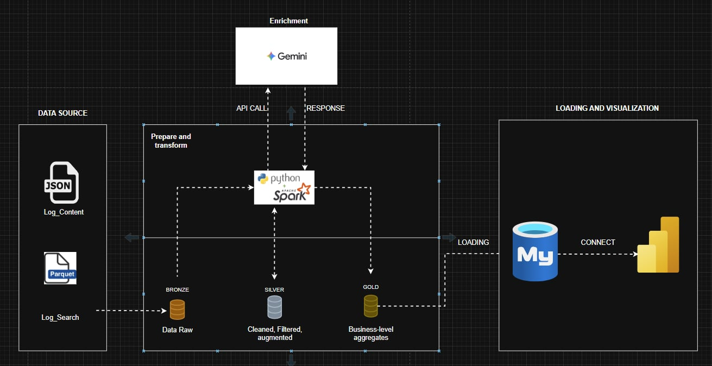
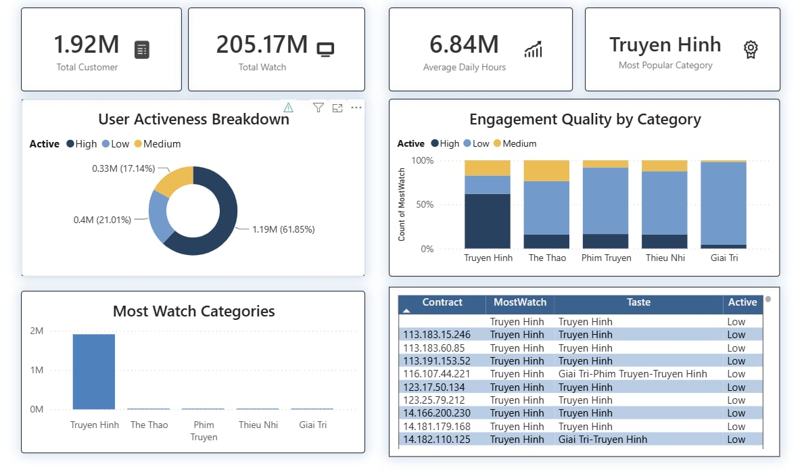
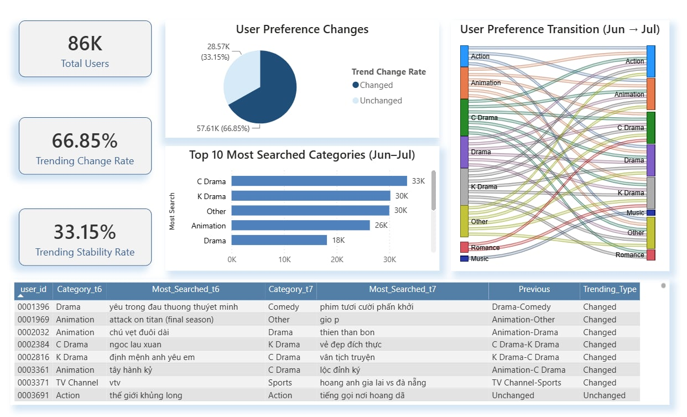

# CUSTOMER 360 BEHAVIORAL ANALYTICS
Processing telecom logs (JSON/PARQUET) using Pyspark and Gemini. This project focuses about behavioral and interaction data.
## OVERALL PIPELINE FLOW

## 1.Overview

**Customer 360** is a data engineering project that builds a unified and comprehensive view of customers by integrating data from multiple touchpoints. The project processes customer viewing and search logs through an end-to-end ETL pipeline using **PySpark**, stores the transformed data in **MySQL**, and visualizes business insights with **Power BI**.

### Key Objectives

* **Unify Customer Data:** Integrate **Content Logs** and **Search Logs** to create a single customer profile.
* **Understand Customer Behavior:** Analyze customer activity levels (High/Low) and identify content preferences based on viewing and search history.
* **Track Preference Trends:** Monitor changes in customer search interests over time to uncover behavioral patterns.
* **Generate Business Insights:** Transform raw log data into meaningful analytics that support customer segmentation and decision-making.

## 2.Detailed process
**Pipeline 1: Log Content Processing (Viewing Data - April)** 

This pipeline processes customer viewing logs to generate customer behavior metrics and preference profiles.
* **Content Classification:** Map raw `AppName` values into standardized content categories including: Truyền hình, Phim ảnh, Giải trí, Thiếu nhi, Thể thao.
* **`Active` User Classification:** Customers are categorized based on the number of active days in a month:
    * **High:** More than **20** active days.
    * **Medium:** Between **10 and 20** active days (inclusive).
    * **Low:** Fewer than **10** active days.
* **Preference Profiling:** Identify each customer's most frequently watched content category (`MostWatch`) and generate an overall content preference profile (`Taste`) based on viewing behavior.

**Pipeline 2: Log Search Processing (Searching Data - June & July)** 
This pipeline analyzes customer search behavior across two consecutive months to identify search preferences and behavioral changes. 
* **Keyword Extraction:** Using **PySpark** to indetify the most frequently searched keyword for each customer on the monthly basis.
* **AI-powered Content Classification:** Integate the `gemini-3.1-flash-lite-preview` model to classify unstructured search keywords into standardized content categories.
* **Search Behavior Analysis:** Compare search categories between **June** and **July** to determin whether a customer's search preference has **Change** or remained **Unchanged**

## 3.Project Structure
* **[etl_script.py](etl_script.py)** Cleans raw data, classifies content categories, calculates customer activity levels, and generates customer preference metrics (`MostWatch`, `Taste`).
* **[main.py](main.py)** Entry point for the Search Log ETL pipeline. Orchestrates the complete workflow, including keyword extraction, AI classification, and trend analysis.
* **[job_mostsearch.py](job_mostsearch.py)** Identifies the most searched keyword for each customer using PySpark and monthly search logs.
* **[job_trending.py](job_trending.py)** Compares customer search categories between June and July to determine whether search preferences have **Changed** or **Unchanged**.
* **[mapping_ai.py](mapping_ai.py)** Uses the `gemini-3.1-flash-lite-preview` model to classify unstructured search keywords into standardized content categories.
## 4.Data Visualization 
📊 **[Link Báo cáo Power BI (Customer 360 Dashboard)](https://app.powerbi.com/links/aHaWP9543p?ctid=14d5de2b-d212-4175-92d5-156ea5b7c037&pbi_source=linkShare) 
### Overview of user behavior in April 
   * **1.92 million** customer contracts were processed and analyzed.
   * **Customer Activity:** **71.64%** of customers were identified as **High**, indicating strong engagement with the platform, while **21.01%** were categorized as **Medium** and **17.14%** were categorized as **Low**.
   * **Most Popular Content:** **Truyen Hinh** was the most frequently consumed content category across all customers.
   * **Average Daily Hours:** Customers watched a total of **6.84 million hours** of content during the month.

### Search Analysis & Trend (June-July) 
   * **Recurring Search Users:** Approximately **86,000 customers** performed searches in both **June** and **July**.
   * **Search Preferences:** **C-Drama** was the most searched content category in both **June** and **July**.
   * **Search Behavior Changes:** Approximately **69.13%** of customers changed their preferred search category between **June** and **July**, while **33.15%** maintained the same search preference.
   * **Key Search Transitions:** The most common shifts in search preferences occurred between **Drama → C-Drama**, **Drama → Romance**, and **Romance → Drama**.

## 5.Technology:
   * **Language:** Python
   * **Data Processing:** PySpark (**Spark SQL**, **Window Functions**)
   * **AL & NLP:** Gemini
   * **Visualization:** Power BI
   * **Database:** MySql, CSV

